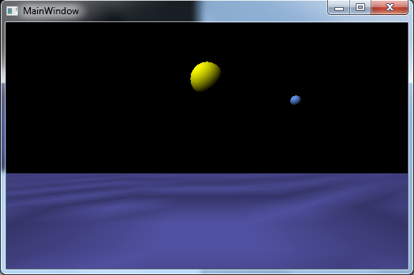

# OnePlanet

Created by Mariusz K. (mkre@op.pl)

###This is a simple simulation of the motion of a planet around the sun 

##Parts are taken from: 

- https://github.com/mkmkmk/NoToolkitWpfApp
- http://www.feynmanlectures.caltech.edu/I_09.html#Ch9-S7

    
##Requires:
- .Net 4.5
- DirectX11
- SharpDX 3.0+ (via NuGet)

##Features:
- Numerical solution of the dynamical equations
- WPF application
- no SharpDX.Toolkit required
- directional light implemented by shader
- compilation of shaders during runtime

 

##Licensing:
- WTFPL